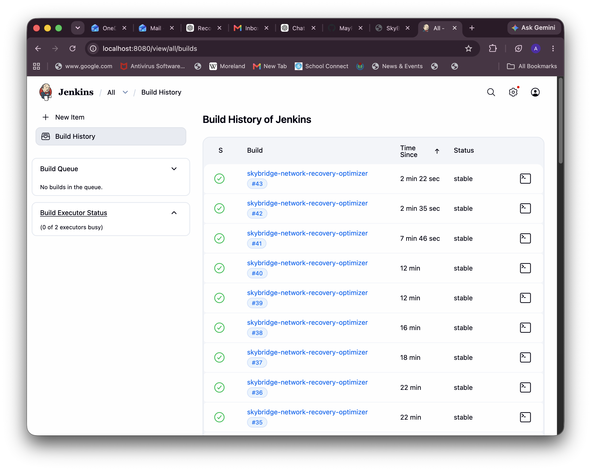
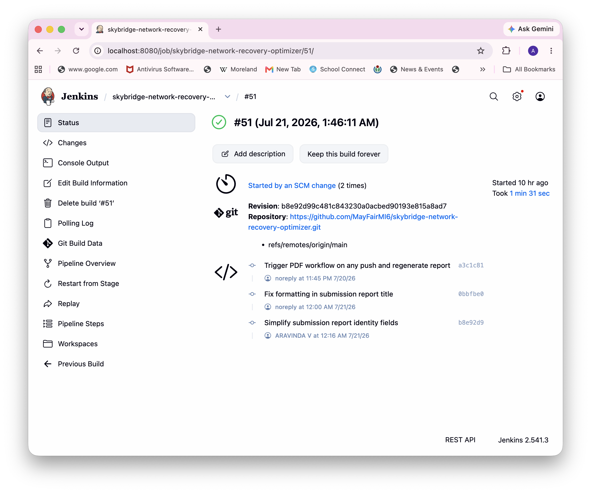
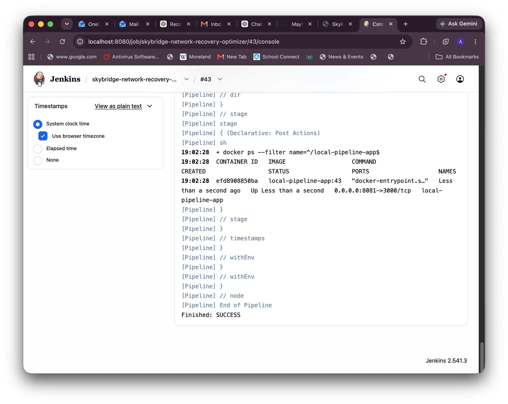
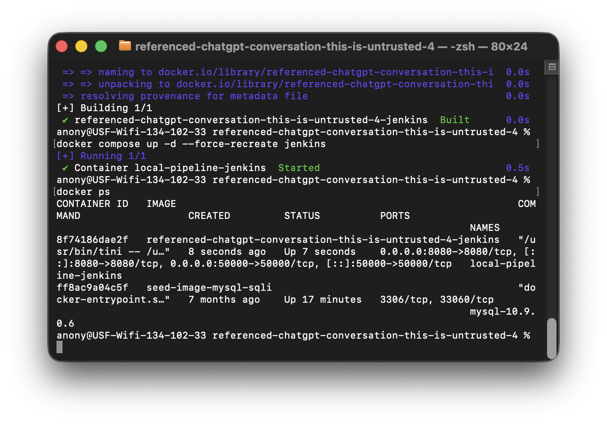
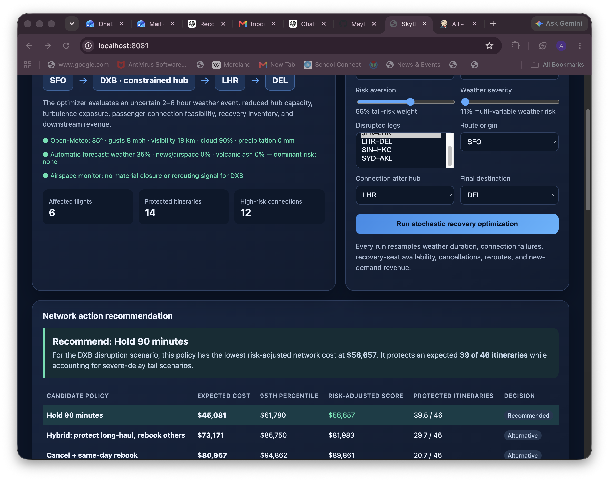

# Automated Deployment Pipeline — Submission Report

**Name:**  
**GitHub repository:** https://github.com/MayFairMI6/skybridge-network-recovery-optimizer

## Completed requirements

- [x] **Git/GitHub:** The GitHub repository contains the SkyBridge Network Recovery Optimizer application, `Dockerfile`, `Jenkinsfile`, Terraform configuration, Jenkins Docker setup, and documentation.
- [x] **Automated CI Trigger:** Jenkins SCM polling is configured as `H/2 * * * *`. A GitHub push was detected by Jenkins and automatically started successful build #46 with the SCM-trigger cause; **Build Now** was not used.
- [x] **Jenkins (Builder):** Jenkins checks out the repository, builds a Docker image tagged with the Jenkins build number, and runs `terraform apply`.
- [x] **Terraform (Deployer):** Terraform uses the `kreuzwerker/docker` provider and the local Docker socket to create or replace the deployed application container.
- [x] **Docker (Runtime):** Docker Desktop hosts the Jenkins container and the deployed SkyBridge application container.

## Local setup

This project runs locally on macOS using Docker Desktop. The deployed application is SkyBridge Network Recovery Optimizer, a stochastic classroom simulation that evaluates airline-wide recovery actions for a weather-constrained hub. Jenkins runs in a Docker container named `local-pipeline-jenkins`, started with Docker Compose. The Docker Compose configuration mounts the Docker Desktop socket (`/var/run/docker.sock`) into the Jenkins container. This allows the Docker CLI and Terraform Docker provider inside Jenkins to communicate with the Docker Desktop daemon.

The application uses randomized Monte Carlo trials and a non-linear, risk-adjusted cost score rather than a deterministic fare calculator. It compares flight holds, cancellation/rebooking, hotel protection, and hybrid recovery actions. It also applies regulated recovery-inventory rules: priority multi-leg passengers are protected, volunteers are sought before involuntary action, and flexible low-priority guests are considered for safe reaccommodation. The overbooking/recovery recommendation varies with predicted disruption severity and geopolitical reroute exposure. Its seven-day horizon emphasizes the first 72 hours for active recovery decisions; days 4–7 use an automatically predicted last-minute demand forecast to produce bounded new-sale fares, while disrupted passengers retain fare protection.

The hub selector covers North American, European, Asian, Middle Eastern, Australian, and New Zealand hubs. The dashboard automatically uses Open-Meteo weather signals, GDELT aviation-disruption news signals, and public volcanic-ash advisory signals. Its weather score considers wind speed and gusts, visibility, cloud layers, precipitation/rain/showers/snowfall, pressure, and weather codes. The dashboard visibly reports the automatic forecast and airspace monitor; if an external source is unavailable, it reports the unavailable/low-signal state rather than fabricating an alert.

The scenario inputs are synthetic and version-controlled in `data/passengers.json`, `data/flights.json`, and `data/network.json`. These files provide multi-leg passenger itineraries, flight schedules and remaining seats, hub topology, disruption assumptions, and recovery-cost parameters. No personally identifiable passenger data is used.

This setup is Docker-outside-of-Docker: Jenkins does not run a second Docker daemon. Instead, it manages Docker Desktop directly. SkyBridge is deployed as a sibling container named `local-pipeline-app`, not as a nested container inside Jenkins. The application is exposed at `http://localhost:8081`.

The Jenkins job is configured as a Pipeline job using **Pipeline script from SCM**. Jenkins reads the `Jenkinsfile` from the GitHub repository. For a public repository, no GitHub checkout credential is required. For a private repository, Jenkins uses a GitHub credential stored in Jenkins with read access to the repository.

## Pipeline behavior

When a build runs, Jenkins first checks out the configured Git branch. It then builds the SkyBridge optimizer Docker image and tags it as `local-pipeline-app:<Jenkins build number>`. Next, Jenkins changes into the `terraform` directory and runs `terraform init` followed by `terraform apply -auto-approve`.

Terraform uses the `kreuzwerker/docker` provider to deploy the image as the `local-pipeline-app` container. The deployed container listens internally on port 3000 and is published to port 8081 on the Mac. Each new Jenkins build passes a new image tag to Terraform, which updates the deployed container to use the new image.

The `Jenkinsfile` also enables SCM polling with `H/2 * * * *`, so Jenkins checks the repository approximately every two minutes. This was verified when a GitHub push automatically started successful Jenkins build #46 with the SCM-trigger cause.

## Verification evidence

The following evidence was captured from my own local environment on July 20, 2026.

1. **Successful Jenkins build history**  
     
   The build-history screenshot shows multiple successful Jenkins builds for the SkyBridge Pipeline job.

2. **Automated SCM polling trigger**  
     
   Build #51 shows the green successful status and the explicit “Started by an SCM change” cause, confirming Jenkins started it from repository polling rather than **Build Now**.

3. **Successful Jenkins console output**  
     
   The console screenshot shows Terraform creating `local-pipeline-app:43`, the Docker port mapping `8081->3000`, and `Finished: SUCCESS`.

4. **Docker runtime evidence**  
     
   The terminal screenshot shows Docker Compose starting the `local-pipeline-jenkins` container and `docker ps` confirming that Jenkins is running on ports 8080 and 50000. The successful Jenkins console above independently confirms Terraform created the sibling application container on port 8081.

5. **Running deployed application and automatic forecast**  
     
   The browser screenshot shows the deployed SkyBridge optimizer at `http://localhost:8081`, including its Jenkins build number, automatic weather/airspace/ash forecast, computed metrics, and recommended recovery policy.

## How I verified the pipeline

1. I started Docker Desktop.
2. From the repository root, I ran `docker compose build` and `docker compose up -d`.
3. I opened Jenkins at `http://localhost:8080`, completed the initial setup, installed the required plugins, and created a Pipeline job pointing to my GitHub repository.
4. I clicked **Build Now** once to confirm the initial deployment. I confirmed the build succeeded in Jenkins.
5. I verified the deployed containers by running `docker ps --filter name=local-pipeline-app` and by checking Docker Desktop.
6. I opened `http://localhost:8081` in a browser and confirmed that the SkyBridge optimizer loaded and returned a recovery recommendation.
7. I pushed the PDF-report workflow commit to GitHub and did not use **Build Now**. Jenkins detected the change through its `H/2 * * * *` poll, queued the job as an SCM change, and automatically ran successful build #46. I confirmed the Jenkins build record reports the SCM-trigger cause.
